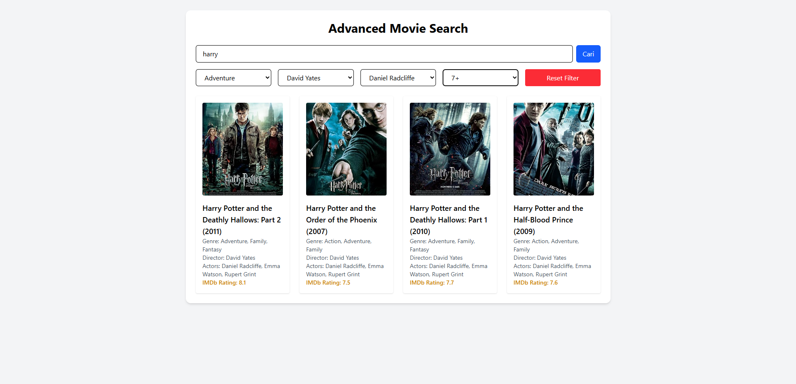

# 🎬 Aplikasi Pencarian Film (OMDb + React + Axios)

Aplikasi web berbasis **React** yang memungkinkan pengguna mencari film melalui [OMDb API](http://www.omdbapi.com/) dan memfilter hasil berdasarkan genre, sutradara, aktor, dan rating IMDb.

## ✨ Fitur Utama

* 🔍 Cari film berdasarkan judul melalui API publik OMDb.
* 🧠 Opsi filter otomatis muncul berdasarkan hasil pencarian.
* 🎯 Filter film berdasarkan:

  * Genre
  * Sutradara
  * Aktor
  * Rating IMDb minimum
* 💡 Dibuat menggunakan React, Axios, dan Tailwind CSS untuk tampilan yang responsif dan performa cepat.

## 🔧 Teknologi yang Digunakan

* **React** – Library UI utama
* **Axios** – Untuk mengambil data dari OMDb API
* **Tailwind CSS** – Framework CSS untuk desain modern dan responsif

## 🖼️ Tampilan Aplikasi




## 🚀 Cara Menjalankan

### 1. Clone repository

```bash
git clone https://github.com/username/omdb-movie-search-app.git
cd omdb-movie-search-app
```

### 2. Install dependensi

```bash
npm install
```

### 3. Tambahkan API Key dari OMDb

Buka file `MovieSearch.jsx`, lalu ganti `API_KEY` dengan API key kamu:

```js
const API_KEY = 'masukkan_api_key_kamu_di_sini';
```

👉 Kamu bisa mendapatkan API key gratis di: [http://www.omdbapi.com/apikey.aspx](http://www.omdbapi.com/apikey.aspx)

### 4. Jalankan aplikasi

```bash
npm run dev
# atau
npm start
```

Buka [http://localhost:3000](http://localhost:3000) di browser untuk melihat aplikasi.


## 🧠 Cara Kerja Filter

1. Pengguna memasukkan judul film dan menekan tombol cari.
2. Aplikasi mengambil maksimal 10 film pertama dari hasil pencarian.
3. Detail lengkap tiap film diambil menggunakan `imdbID`.
4. Dari data tersebut, sistem mengekstrak genre, sutradara, dan aktor untuk digunakan sebagai opsi filter.
5. Penyaringan dilakukan langsung di frontend berdasarkan filter yang dipilih.

## ⚠️ Catatan

* Versi gratis dari OMDb API hanya mengizinkan hingga 1000 request per hari.
* Aplikasi ini hanya menampilkan 10 film pertama untuk efisiensi.
* Bisa dikembangkan lebih lanjut dengan fitur pagination, filter tahun, atau penyimpanan favorit.

## 📄 Lisensi

Proyek ini dilisensikan di bawah lisensi MIT. Silakan lihat file [LICENSE](LICENSE) untuk detailnya.
